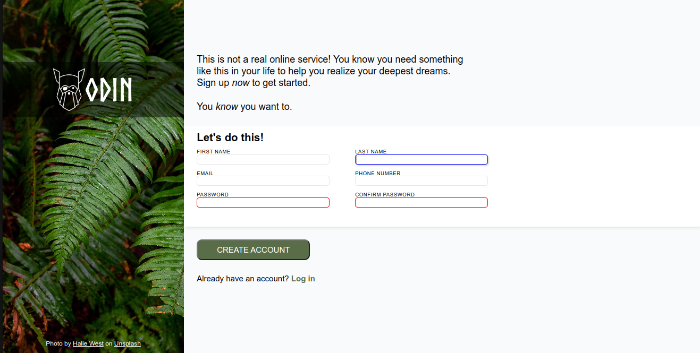
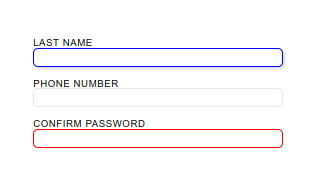
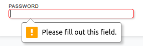
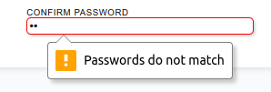

# Simple Sign Up Form

this is a simple sign up form to demonstrate my ability of
designing and styling form controls of html.

## Features

- **different style for different psudo class**
  (icluding ":focus", ":invalid")

  

- **HTML validating**
  (for input of email and password)\

  

- **password confirmation**
  (usign Javascript for validating)

  

## _Features to add in future_

- add an error class to password input for matching confirmation
